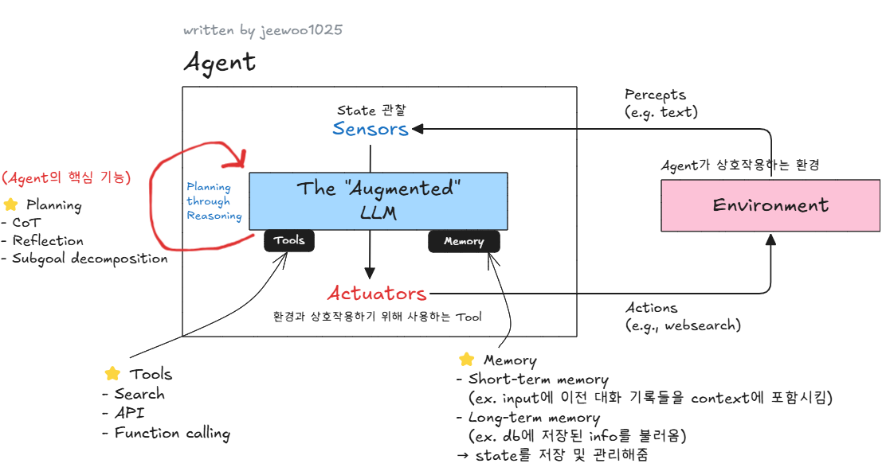
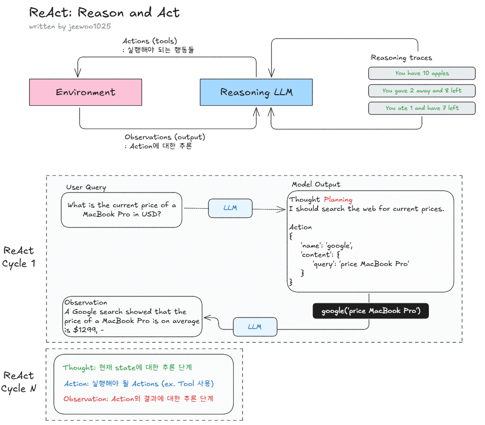
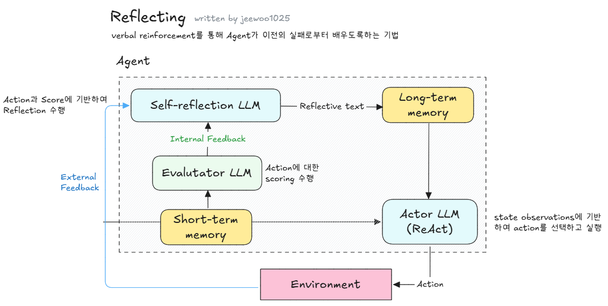

# Agent

본 글은 [LLM Agents에 관한 비주얼 가이드](https://tulip-phalange-a1e.notion.site/LLM-Agents-1b9c32470be2800fa672e82689018fc4)을 요약한 정리본이다. 참고로 원문은 [A Visual Guide to LLM Agents](https://newsletter.maartengrootendorst.com/p/a-visual-guide-to-llm-agents)이다.

## 🥸 What is Agent?
environment를 관찰하여 Plan을 수립하고 Action 실행하는 system

### 핵심 구성요소 3가지: Memory, Tools, Planning
`text 기반 관점에서 작성됨`
#### Memory
- LLM: 이전 history(=state)를 기억하지 못함
- Agent: 전반적인 history(=state)를 추적하고 관리함 

아래 2가지 case로 구성됨
- Short-Term Memory: input에 이전 대화의 history를 포함.
- Long-Term Memory: 오랜 기간 저장된 knowledge space를 통해 가장 관련도가 높은 information를 추출해서 input에 함께 주어짐.

#### Tools
- 특정 LLMs이 외부 환경과 상호작용하거나 외부 App을 사용할 수 있도록함
- 사례: 최신 정보를 얻기 위해 데이터를 가져오거나, 회의 일정을 잡는 등 특정 행동을 수행하는 경우
- [Toolformer](https://arxiv.org/abs/2302.04761) 같이 LLMs에게 Tools 사용을 지시하는 Prompt를 제공하는 것 뿐만 아니라 Tool 사용 자체에 특화하여 model을 학습시키는 방식을 포함함

#### Planning
: 어떤 Action을 취할 지 결정하기 위해, Plan을 수립하는 단계. 즉, 주어진 task를 실행 가능한 단계들로 분할하는 과정을 의미함.
(Planning은 내용이 많기 때문에 다음 section으로 넘어감.)

 

## ⛓️ Planning
Planning을 수행하기 위해서는 Reasoning을 수행해야함.

### Reasoning (a.k.a. Thinking)
LLMs이 질문에 답하기 전, "생각"하는 경향을 보이는 모델

1) Fine-tuning하는 경우
- [QwQ](https://qwenlm.github.io/blog/qwq-32b-preview/)

2) 특정한 Prompt Engineering을 수행하는 경우
- Few shot prompting: [Language models are few-shot learners.](https://arxiv.org/abs/2005.14165)
- CoT: [Chain-of-thought prompting elicits reasoning in large language models.](https://arxiv.org/abs/2201.11903)
- Zero-shot prompting + "Let's think step-by-step": [Large language models are zero-shot reasoners.](https://arxiv.org/abs/2205.11916)

### ReAct: Reason + Act
Paper: [ReAct: Synergizing Reasoning and Acting in Language Models](https://arxiv.org/abs/2210.03629)

LLMs은 ReAct prompt를 활용하여 Thought, Action, Observation의 cycle을 반복하는 방식으로 동작을 수행함.
- Thought: 현재 state에 대한 추론
- Action: 실행해야될 Actions
- Observation: Action에 대한 추론 

단점: Feedback을 받는 프로세스(=Success/Failure에 대한 분석하는 과정)가 빠져있음 

### Reflection
Paper: [Reflexion: Language Agents with Verbal Reinforcement Learning](https://arxiv.org/abs/2303.11366)

Agent가 이전의 failure로부터 배우도록 돕는 기법. 즉, Feedback을 받아 Reflection하는 단계가 추가됨. 3가지 LLM으로 구성됨
- Actor: state observations에 기반해 Action을 선택하고 실행
- Evaluator: Actor가 만든 결과를 Scoring함
- Self-reflection: Actor가 취한 Action과 Evaluator가 생성한 score를 돌아보며 평가함.

## Agent vs Agentic System
### ✅ 정의 (Definition)
비유하자면 아래와 같음:
* **Agent**: 혼자 일하는 유능한 직원
* **Agentic System**: 부서 간 협업이 잘 이루어지는 스마트한 조직

| 개념                            | 정의                                       |
| ----------------------------- | ---------------------------------------- |
| **Agent (에이전트)**              | 환경을 인식하고 특정 목표를 달성하기 위해 자율적으로 행동하는 단일 지능형 주체 (스스로 Planing하고 Action한다)   |
| **Agentic System (에이전틱 시스템)** | 여러 Agent들이 상호작용하며 복잡한 목표를 달성하도록 설계된 통합 시스템 |

### ✅ 참고 문헌 
* OpenAI (2024), [Agentic AI 블로그](https://openai.com/blog/agentic-ai)
* Microsoft (2023), [AutoGen Framework 논문](https://arxiv.org/abs/2309.00462)
* Stanford CRFM (2024), [Agentic AI 정의](https://crfm.stanford.edu/2024/03/20/agentic-ai.html)
* DeepMind (2023), *Communicative Agents*
* ReAct (2022), [Reason + Acting 기반 Agent](https://arxiv.org/abs/2210.03629)

